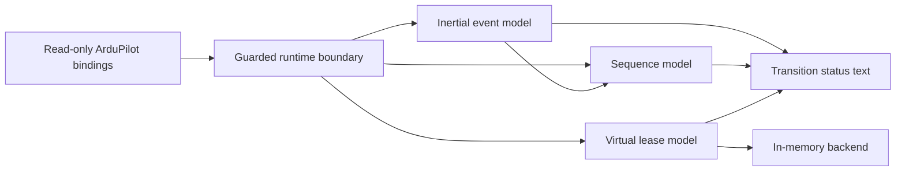

# Architecture and design decisions

The diagram shows demonstration responsibilities. It is not a real aircraft configuration.

## Boundaries

Models receive plain numeric/boolean inputs and maintain their own small state. The runtime boundary handles optional bindings, exceptions, finite-number checks and scheduling. Read errors remain unknown values; they do not become a confirmed disarm. Each wrapper supplies neutral demonstration configuration.

ArduPilot loads the wrappers as scripts. Modules belong in `APM/scripts/modules/` and are imported by their unique `portfolio_*` names. Models do not register callbacks or access hardware. The only writes in firmware-facing code are status messages; no ArduPilot parameters or outputs are written.

## Timing on a constrained interpreter

The runtime subtracts successive `millis()` unsigned userdata values before converting their small difference. It then accumulates a modular epoch of 65,536 milliseconds, which remains exactly representable with float32 numbers. Model durations must be positive and shorter than half the epoch. Model differences are modulo that epoch. A raw-clock gap of at least half an epoch is invalid rather than ambiguously wrapped; smaller gaps are checked against each model's callback budget.

This design avoids converting full uptime to float32, which can lose millisecond precision. Host tests exercise unsigned rollover, epoch rollover, long uptime and skipped epochs. It still depends on firmware scheduling and the actual binding implementation; it is not an execution deadline guarantee.

## Failure ownership

The filter discards candidate dwell on uncertainty. The sequence latches cancellation until a confirmed reset. The lease retains ownership records until cleanup is acknowledged. The lease's backend contract requires a boolean acknowledgement; no assumption is made that real RC bindings implement that contract.

Acquisition can have an uncertain side effect before a backend reports failure, so rollback includes every attempted resource. The resource count is bounded at eight, keeping per-tick acquisition/release work bounded. State messages are best effort and deduplicated; telemetry failure does not change model decisions.

## Scope choices

One source example motivated three independently written demonstrations. Their new layout, filtering, tests, timing and virtual backend are public-demo decisions. No employer structure, comments, operating values, control mapping or source history was imported. Missing evidence for UART/GPIO/relay/direct MAVLink/parameter integration is not filled with invented features or historical claims.
