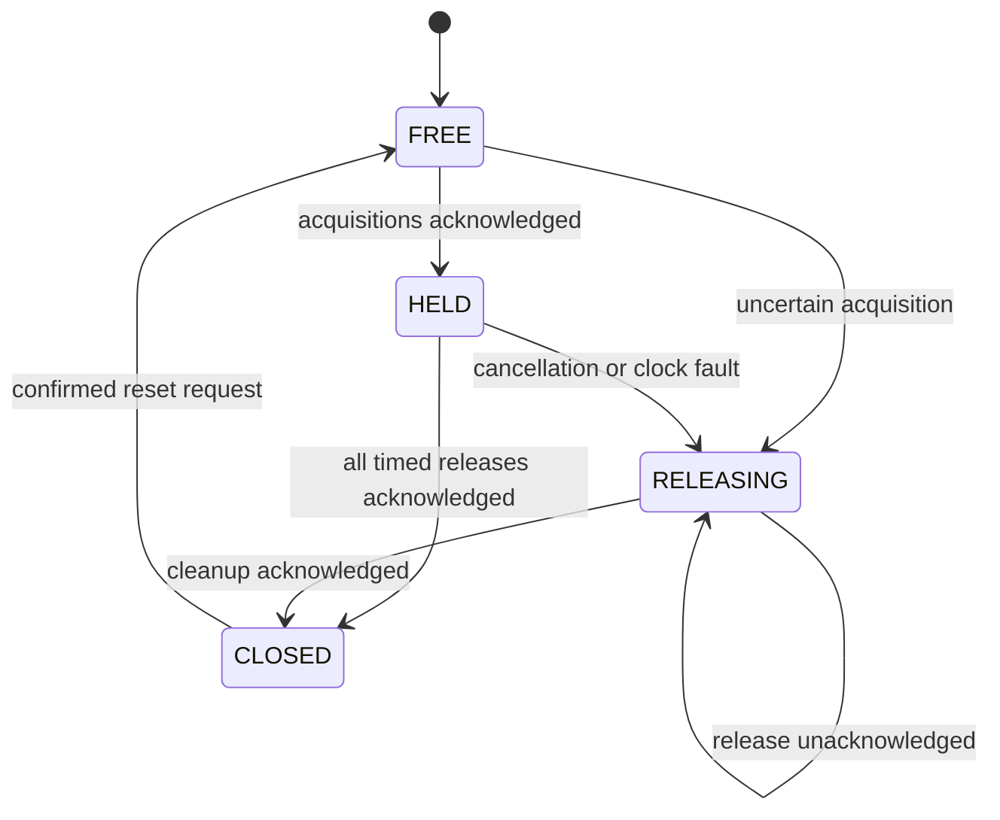

# Virtual control lease

## Problem

Temporary control ownership must not be reported as released when cleanup failed. A partially applied acquisition also needs cleanup, even if its acknowledgement was lost.

## Engineering goal

Explain a lease contract and confirmed handoff through fault-injectable, in-memory resources. This example demonstrates reasoning about RC-override lifecycle without issuing RC overrides.

## Architecture / logic

`portfolio_lease.lua` owns up to eight named resources. Each has a synthetic lifetime. A backend must explicitly return `true` for acquisition or release acknowledgement. The supplied wrapper backend changes only a Lua table.

The wrapper observes arming and mode, and probes `rc:get_channel(1)` for availability of the first generic input. That probe assigns no roll, pitch, throttle or other mapping. Mode change, unknown conditions or a missed interval revoke the virtual request. After closure, confirmed disarm is required before another cycle. Transaction rollback and confirmed-release retry are additions to the public model.

## Main state transitions

Failed deadline releases stay owned and retry on subsequent ticks. Failed cancellation releases stay in `RELEASING`. Acquisition rollback visits attempted resources in reverse order and includes a request that failed to acknowledge.

## ArduPilot API usage

The wrapper reads `arming:is_armed()`, `vehicle:get_mode()`, `rc:get_channel(1)` and `millis()`, then sends `gcs:send_text()`. The checked upstream Lua binding uses **one-based** `get_channel()` indices. This example never calls `RC_Channel:set_override()`. [Pinned references](../../docs/api-reference.md).

## Error / failsafe behavior

Unknown state, mode mismatch, missing channel capability, clock gaps and callback errors revoke virtual ownership. A false/nil acknowledgement or backend exception does not erase the pending release record. Resources are never reacquired before cleanup is confirmed and the cycle reset.

This is not a hardware failsafe. If the script is terminated, its in-memory simulation terminates with it. No hardware ownership exists here. A real output backend would require independent timeout protection, mapping validation and binding-specific acknowledgement semantics; it is deliberately absent.

## Testing / validation

Host fault injection covers partial acquisition, uncertain side effects, failed/throwing releases, retry, independent deadlines, mode changes and rollover. Wrapper tests trap real output calls. The supplied backend cannot reproduce electrical effects or firmware override timeout behavior.

Validation procedure: run the wrapper in SITL and compare only virtual resource counts/status transitions while changing synthetic arming/mode conditions. HIL or an actuator bench is unnecessary for the supplied backend and has not been used.

## Limitations and possible improvements

The capability probe verifies that an object can be obtained, not receiver health, operator consent or mapping correctness. Pending state is volatile. A reusable device adapter could later expose verified readback/acknowledgement and an independent watchdog, with separate requirements and bench verification.
