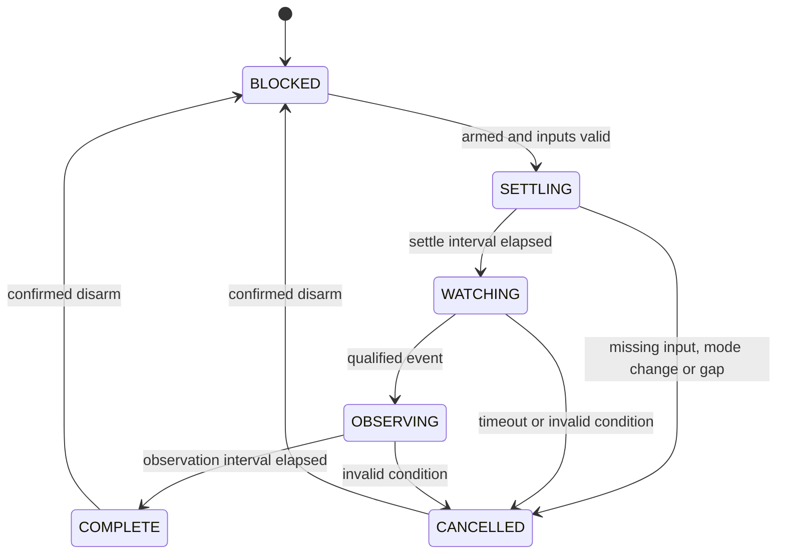

# Guarded sequence observer

## Problem

A timed sequence needs clear entry, cancellation, completion and reset rules when inputs change or disappear.

## Engineering goal

Demonstrate state coordination across arming, mode, inertial events and scheduling, while keeping the public example read-only.

## Architecture / logic

The wrapper takes a guarded snapshot of `armed`, `mode` and acceleration magnitude. The pure sequence model captures the initial mode, waits for a settle interval, opens a bounded event window and observes a qualified event for a fixed interval. It shares the inertial filter module. No mode number or aircraft tuning is embedded.

The settle/window/observe mechanism reflects the generic source behavior. Event filtering, the observation-only policy and modular fault tests are public-demo design choices. Completion means the observation sequence finished; it does not mean an aircraft launched.

## Main state transitions

A confirmed disarm resets any state to `BLOCKED`. Unknown arming is not treated as disarm. `COMPLETE` and `CANCELLED` remain latched while armed. An event at the event-window deadline loses to expiry.

## ArduPilot API usage

`arming:is_armed()`, `vehicle:get_mode()`, `ahrs:get_accel()`, vector components, `millis()` and `gcs:send_text()`. These are reads and status reporting. [Pinned references](../../docs/api-reference.md).

## Error / failsafe behavior

Unknown input, scheduler gap or mode change cancels an active sequence. Timeout cancels the event wait. An unexpected callback exception invalidates the model. This cancellation is observer behavior; it does not change flight-controller failsafes or command a safe flight mode.

## Testing / validation

The host suite drives a full synthetic cycle, cancellation paths, no-restart latch, disarm reset, timeout precedence and bounded clock rollover. A mocked firmware wrapper confirms status transitions and traps output writes.

Can be tested using an isolated SITL session: verify startup blocked state, simulate valid state transitions, change the mode during observation and confirm cancellation. Use synthetic inputs and omit operational missions. SITL/HIL/bench/flight results are not claimed.

## Limitations and possible improvements

The captured mode is a consistency check, not a vehicle-specific mode approval. Sampling state is not atomic across firmware subsystems. Callback limits are observed elapsed-time checks, not real-time guarantees. Future work could add an explicitly configured activation policy and timestamped events after target firmware and requirements are verified.
