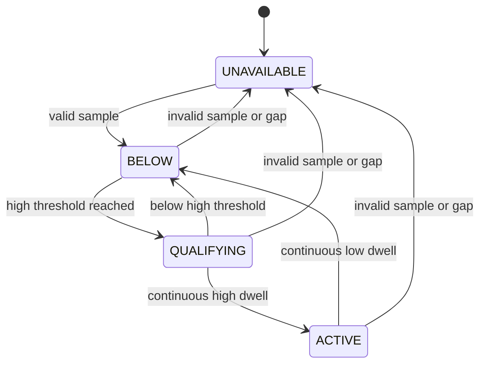

# Inertial event observer

## Problem

A single high accelerometer sample is a weak basis for a timed sequence. Invalid values and gaps must not count toward a continuous event.

## Engineering goal

Observe a sustained magnitude excursion, emit one event per excursion and recover without threshold chatter. This is a generic signal-processing demonstration, not an aircraft launch detector.

## Architecture / logic

`main.lua` reads the AHRS vector through guarded calls and computes its magnitude. `portfolio_inertial.lua` owns qualification and clearing dwell. Configuration is separate from the model in the wrapper. Thresholds and timings are invented demonstration settings, not copied aircraft tuning. Dwell and hysteresis were added for this demo.

## Main state transitions

`ACTIVE` generates one event on entry. Values between the low and high thresholds cannot clear an active event. An invalid sample clears dwell immediately; a scheduling gap requires a fresh qualifying interval.

## ArduPilot API usage

- `ahrs:get_accel()` and Vector3f `x()`, `y()`, `z()` for the sampled magnitude
- `millis()` for unsigned-difference timing
- `gcs:send_text()` for state changes

No position, mission, output, parameter-write or flight-mode API is used. [Pinned references](../../docs/api-reference.md).

## Error / failsafe behavior

Missing methods, exceptions, nil, nonfinite values, implausible magnitudes and missed callback intervals put the model in `UNAVAILABLE`. No actuator action follows any event. GCS failure is best effort and does not stop the model.

## Testing / validation

Host tests cover isolated spikes, sustained events, hysteresis, reset after missing samples, bounds, scheduler gaps and clock rollover. The wrapper is exercised with mock AHRS/GCS bindings and firmware-write traps.

Validation procedure: use SITL to compare AHRS reads with expected magnitude changes and observe state messages. Then, if needed, use an isolated unpowered-output bench to check binding availability and timing. Those procedures have not been executed here.

## Limitations and possible improvements

Magnitude includes gravity and does not identify acceleration direction. Successful API reads do not prove that the sensor data is fresh: this binding provides no sample timestamp to the demo. Values returning unchanged can be valid or frozen. Future work could add a suitable timestamped sensor interface and an explicitly documented directional detector after evidence-backed requirements are available.
